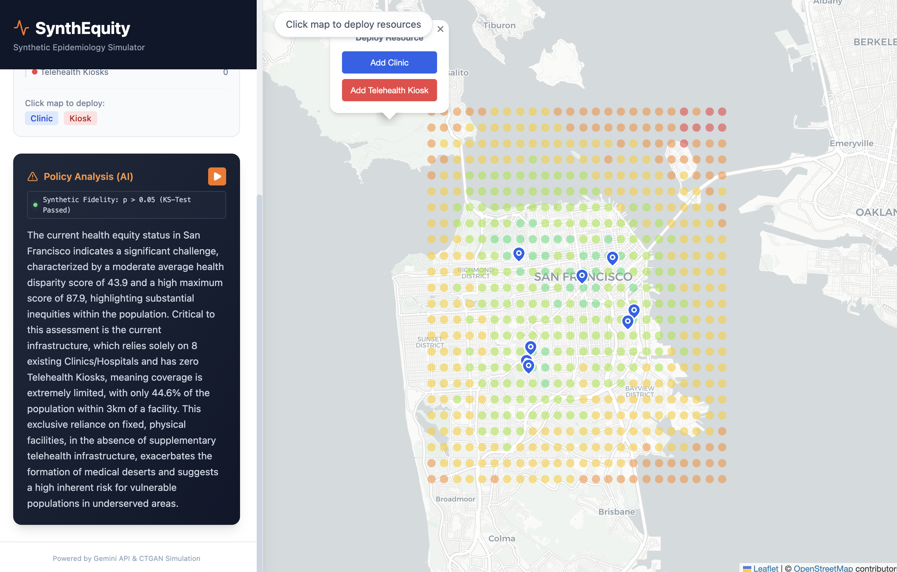
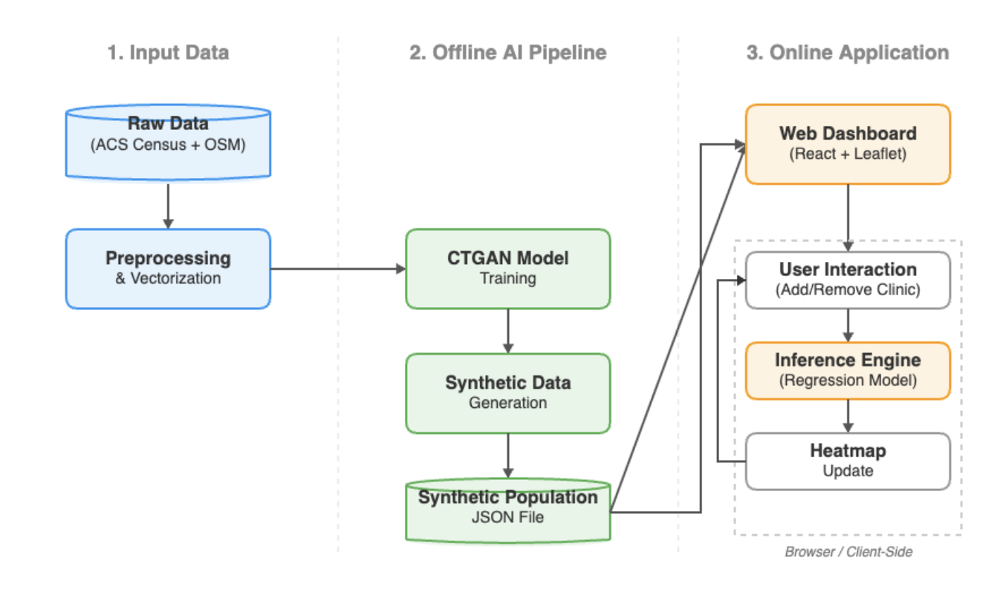

# SynthEquity

### A Computational Epidemiology Framework for Optimizing Healthcare Access via Generative AI

**SynthEquity** is a web-based decision support system designed to bridge the gap between privacy laws and public health utility. By generating a "Privacy-Preserving Synthetic Population" using Generative AI (CTGAN), this tool allows policymakers to model healthcare interventions and visualize health equity in real-time without compromising individual patient privacy.

> **Mission:** To provide a scalable, validated, and ethical framework to make data-driven decisions that build healthier and more equitable communities for everyone.

---

## 📸 Main UI

The SynthEquity dashboard is designed for high-performance, client-side interaction.

* **Interactive Heatmap:** A Leaflet.js-based map rendering "Synthetic Census Blocks." Colors shift in real-time (Red &rarr; Green) to represent the **Health Access Disparity Score**.
* **Intervention Panel:** A sidebar allowing users to "deploy" public health resources (clinics, mobile testing units) onto the map.
* **Real-Time Analytics:** As markers are placed, the browser recalculates risk scores for thousands of synthetic households instantly (< 100ms latency), displaying the projected reduction in community vulnerability.

---

## 🧐 Rationale

Public health resources are frequently allocated based on lagging, aggregate data (e.g., county-level statistics). This "top-down" approach often results in **"medical deserts"**—hyper-local neighborhoods that lack access to care despite adequate regional stats.

While granular analysis solves this, privacy laws (like HIPAA) prevent access to the individual-level data required for precise modeling. **SynthEquity solves this** by training a Generative Adversarial Network to create a synthetic city that is statistically identical to the real one but contains no real people—allowing for unrestricted simulation and modeling.

---

## ⚙️ Architecture & Engineering Goals

### 1. Data Synthesis Pipeline (Offline)
We utilize a **Conditional Tabular Generative Adversarial Network (CTGAN)** via the SDV library.
* **Input:** Raw Census data and anonymized public health records.
* **Process:** The model learns the conditional probabilities and non-Gaussian distributions (e.g., bimodal income) of the real population.
* **Output:** A dataset of 10,000+ synthetic entities that serves as the "Ground Truth."

### 2. Multivariate Risk Modeling
We developed a regression-based **"Health Access Disparity Score"** to quantify vulnerability based on Social Determinants of Health (SDOH):
* Transit Latency
* Household Income
* Geospatial Proximity to Care

### 3. Real-Time Inference Engine (Client-Side)
Unlike traditional GIS tools that rely on slow server-side processing, SynthEquity performs inference entirely in the browser using React and TypeScript.

**Archteciture Diagram:**

  

---

## 🛠 Tech Stack

* **Frontend:** React 19, TypeScript, Vite
* **Mapping:** Leaflet.js, OpenStreetMap
* **AI/ML:** Python, SDV (Synthetic Data Vault), CTGAN, Scikit-Learn (for regression modeling)
* **Data Validation:** Kolmogorov-Smirnov (KS) Test, Pearson’s Correlation Matrix

---

## 📊 Validation

To ensure the "Synthetic City" is a mathematical twin of the real city, the model undergoes rigorous statistical testing:
1.  **Statistical Similarity:** A Kolmogorov-Smirnov (KS) test is performed on distributions. A p-value > 0.05 indicates the synthetic data is statistically indistinguishable from real data.
2.  **Correlation Preservation:** A Pearson’s *r* correlation matrix confirms that complex dependencies between variables (e.g., Poverty &harr; Transit Dependence) are maintained.

---

## 📄 License
[MIT License](LICENSE)